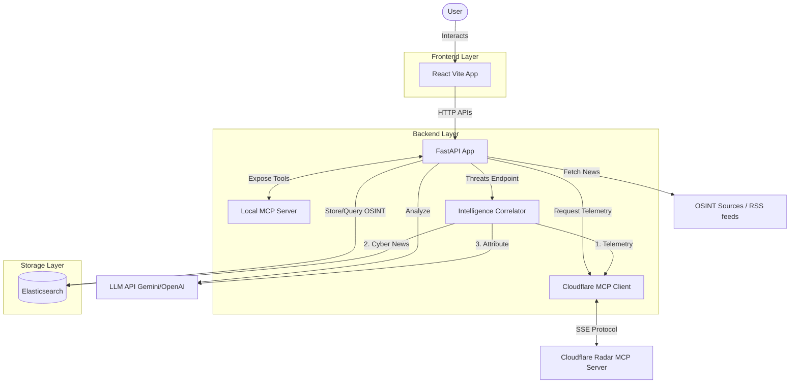

# GeoIntel-360 Dashboard

GeoIntel-360 is a high-performance, three-tier web application designed for monitoring global geopolitics, cybersecurity, and economics. It serves as an Open Source Intelligence (OSINT) command center.

## Project Structure

The project follows a decoupled architecture, divided into three main components functioning together:

- **`frontend/` (The Glass)**: The UI layer built with React, Vite, Tailwind CSS, and Framer Motion. It uses TanStack Query to manage the data fetching state and provides a modern "Intelligence Command Center" aesthetic with dark mode.
- **`backend/` (The Gears)**: A Python FastAPI application that acts as a logic controller and data aggregator. It fetches data from various external sources, normalizes it, and implements LLM-powered summarization (using Gemini or OpenAI). It provides a Model Context Protocol (MCP) server for local tool integration, and an **MCP Client** to fetch remote telemetry (like Cloudflare Radar), synthesizing it completely via an AI **Intelligence Correlator**.
- **`docker-compose.yml` (The Memory)**: Manages a single-node Elasticsearch database container ensuring data persistence, deduplication, and full-text search capabilities across all synchronized intelligence data.

### Architecture Schema



## Tech Stack Overview
- **Frontend**: React 19, Vite, Tailwind CSS v4, Framer Motion, Axios, Recharts.
- **Backend**: Python 3.12, FastAPI, Elasticsearch Client, Google GenAI SDK, OpenAI SDK, MCP Protocol.
- **Persistence**: Elasticsearch 8.12 running via Docker.

## Data Sources

The platform aggregates intelligence from a variety of targeted and specialized open-source data providers:

### 1. Core News & Geopolitics
- **NewsData.io, GNews API, NewsAPI.org, Mediastack**: Aggregators used for broad geopolitical coverage and breaking news filtered by specific keywords.

### 2. Specialized Intelligence Feeds
- **Military & Defense**: War on the Rocks, The Long War Journal, Defense Security Cooperation Agency (DSCA), USNI News.
- **Cybersecurity**: The Hacker News, BleepingComputer, CISA Alerts.
- **Economics & Risk**: Stratfor (Worldview), CFR (Council on Foreign Relations), Bruegel.

### 3. Financial & Economic Data
- **Alpha Vantage**: Daily stock, forex data, and economic indicators.
- **FRED API**: Hard economic indicators (inflation, debt ratios) run by the St. Louis Fed.
- **Twelve Data**: Real-time market data.

### 4. Technical Telemetry & Threat Intelligence
- **Cloudflare Radar MCP**: Provides global internet intelligence, including DDoS attack trends, top targeted industries, and verified internet outages globally. Used by the backend *Intelligence Correlator* alongside OSINT news to attribute specific threat actor campaigns and enterprise victims visually.

## How to Run

Follow these steps to spin up the entire application stack:

### 1. Start the Database (Elasticsearch)

Ensure you have Docker installed and running on your system.
```bash
# In the project root directory
docker-compose up -d
```
*Elasticsearch will start on `localhost:9200`.*

### 2. Start the Backend (FastAPI)

Ensure you have a `.env` file inside the `backend/` directory with your `GEMINI_API_KEY` and other necessary configurations.

```bash
# Navigate to the project root
# Create and activate a virtual environment
python3 -m venv .venv
source .venv/bin/activate

# Install Python dependencies
pip install -r requirements.txt

# Navigate to the backend directory and run the server
cd backend
fastapi dev main.py
# Or use uvicorn directly:
# uvicorn main:app --reload
```
*The FastAPI backend will run on `http://localhost:8000`. API documentation is available at `http://localhost:8000/docs`.*

### 3. Start the Frontend (React / Vite)

In a new terminal instance:

```bash
# Navigate to the frontend directory
cd frontend

# Install Node dependencies
npm install

# Start the Vite development server
npm run dev
```
*The frontend will run on `http://localhost:5173` (or `3000` depending on Vite's assignment).*
