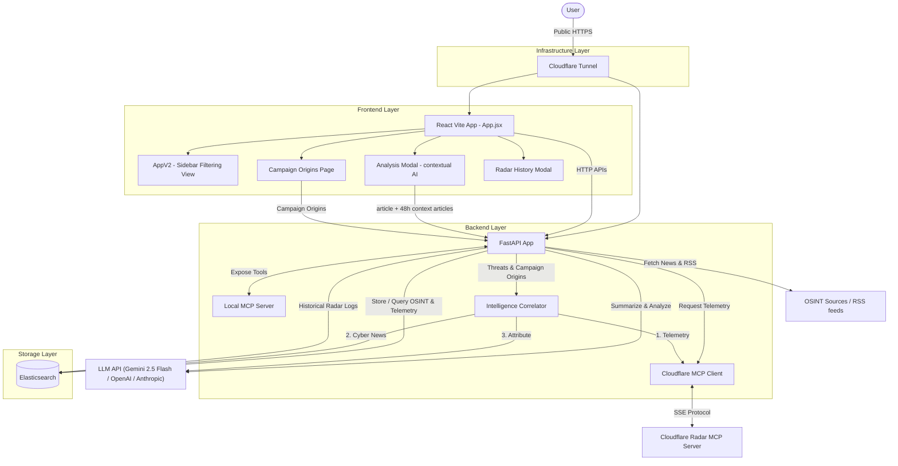

# GeoIntel-360 Dashboard

GeoIntel-360 is a high-performance, three-tier web application designed for monitoring global geopolitics, cybersecurity, and economics. It serves as an Open Source Intelligence (OSINT) command center.

## Project Structure

The project follows a decoupled architecture, divided into three main components functioning together:

- **`frontend/` (The Glass)**: The UI layer built with React, Vite, Tailwind CSS, and Framer Motion. It uses TanStack Query to manage data-fetching state and provides a modern "Intelligence Command Center" aesthetic with dark mode. The V2 application (`AppV2`) includes a global real-time sidebar for precise date and source filtering, a dedicated **Campaign Origins** map, and animated historical telemetry modals.
- **`backend/` (The Gears)**: A Python FastAPI application that acts as a logic controller and data aggregator. It fetches data from various external sources, normalizes it, and implements LLM-powered summarization switchable between **Gemini 2.5 Flash**, **OpenAI GPT-3.5**, and **Anthropic Claude 3 Haiku** via the `LLM_PROVIDER` env variable. It provides a Model Context Protocol (MCP) server for local tool integration, and an **MCP Client** to fetch remote telemetry from Cloudflare Radar, synthesized by an AI **Intelligence Correlator**.
- **`docker-compose.yml` (The Memory)**: Manages a single-node Elasticsearch container ensuring data persistence, deduplication, and full-text search across multiple intelligence indices (`geointel_articles` for OSINT news and `geointel_radar_events` for technical telemetry logs).

### Architecture Schema



## Tech Stack Overview
- **Frontend**: React 19, Vite, Tailwind CSS v4, Framer Motion, Axios, Recharts, TanStack Query.
- **Backend**: Python 3.12, FastAPI, Elasticsearch Client, Google GenAI SDK (`gemini-2.5-flash`), OpenAI SDK, Anthropic SDK, MCP Protocol, `python-dateutil`.
- **Persistence**: Elasticsearch 8.12 running via Docker with multi-index mapping (Articles & Events).
- **Infra**: Cloudflare Tunnel for public HTTPS exposure of both frontend (`intel.shipzee.org`) and backend API (`api-intel.shipzee.org`).

## Data Sources

The platform aggregates intelligence from a variety of targeted and specialized open-source data providers:

### 1. Core News & Geopolitics
- **NewsData.io, GNews API, NewsAPI.org, Mediastack**: Aggregators used for broad geopolitical coverage and breaking news filtered by specific keywords.

### 2. Specialized Intelligence Feeds
- **Military & Defense**: War on the Rocks, The Long War Journal, Defense Security Cooperation Agency (DSCA), USNI News.
- **Cybersecurity**: The Hacker News, BleepingComputer, CISA Alerts.
- **Economics & Risk**: Stratfor (Worldview), CFR (Council on Foreign Relations), Bruegel.

### 3. Financial & Economic Data
- **Alpha Vantage**: Daily stock, forex data, and economic indicators.
- **FRED API**: Hard economic indicators (inflation, debt ratios) run by the St. Louis Fed.
- **Twelve Data**: Real-time market data.

### 4. Technical Telemetry & Threat Intelligence
- **Cloudflare Radar MCP**: Provides global internet intelligence, including DDoS attack trends, top targeted industries, and verified internet outages globally. Used by the backend *Intelligence Correlator* alongside OSINT news to attribute specific threat actor campaigns and enterprise victims visually.

## Key Features

- **Multi-LLM Provider Support**: Switch between **Gemini 2.5 Flash**, **OpenAI GPT-3.5**, and **Anthropic Claude 3 Haiku** via the `LLM_PROVIDER` environment variable.
- **Contextual AI Analysis**: The `AnalysisModal` enriches every article summary by passing up to 10 related articles from the last 48 hours as context to the LLM, producing a comprehensive intelligence brief with a "Related News" section.
- **Campaign Origins Map**: `CampaignOriginsPage` visualizes the geographic attribution of active threat actor campaigns detected by the Intelligence Correlator (`ThreatMap` component).
- **Global AppV2 Filtering**: Time-series calendar filters and modular source-selection sidebars (`SidebarFilter`) that query Elasticsearch indices natively.
- **Live Historical Outage Tracking**: The backend asynchronously indexes active Cloudflare network anomalies and threat campaigns into Elasticsearch, surfaced via an interactive `RadarHistoryModal`.
- **MCP Dossier**: `McpDossierModal` presents enriched intelligence dossiers fetched via the local MCP server.

## Environment Configuration

### Backend (`backend/.env`)
Key variables:
```env
LLM_PROVIDER=gemini         # Options: gemini | openai | anthropic
GEMINI_API_KEY=...
OPENAI_API_KEY=...
ANTHROPIC_API_KEY=...
ELASTICSEARCH_URL=http://localhost:9200
# Other API keys (Cloudflare Radar, Newsdata, GNews, etc.)
```

### Frontend (`frontend/.env`)
```env
# Uncomment for production / Cloudflare Tunnel deployment, then rebuild:
# VITE_API_URL=https://api-intel.shipzee.org/api
```
> ⚠️ When deploying on a remote machine via Cloudflare Tunnel, you **must** uncomment `VITE_API_URL` and rebuild the frontend (`npm run build`).

## How to Run

Follow these steps to spin up the entire application stack:

### 1. Start the Database (Elasticsearch)

Ensure you have Docker installed and running on your system.
```bash
# In the project root directory
docker-compose up -d
```
*Elasticsearch will start on `localhost:9200`.*

### 2. Start the Backend (FastAPI)

Ensure you have a `.env` file inside the `backend/` directory with your API keys and configurations.

```bash
# From the project root — create and activate a virtual environment
python3 -m venv .venv
source .venv/bin/activate

# Install Python dependencies
pip install -r requirements.txt

# Navigate to the backend directory and run the server
cd backend
uvicorn main:app --host 0.0.0.0 --reload
```
*The FastAPI backend will run on `http://localhost:8000`. API docs available at `http://localhost:8000/docs`.*

### 3. Start the Frontend (React / Vite)

In a new terminal instance:

```bash
cd frontend
npm install

# Local development:
npm run dev

# For LAN / Cloudflare Tunnel access:
npm run dev -- --host
```
*The frontend will run on `http://localhost:5173`.*